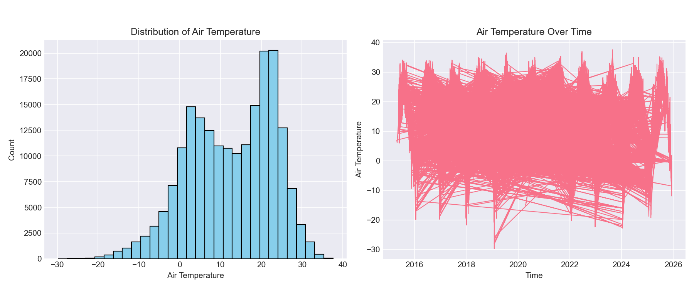
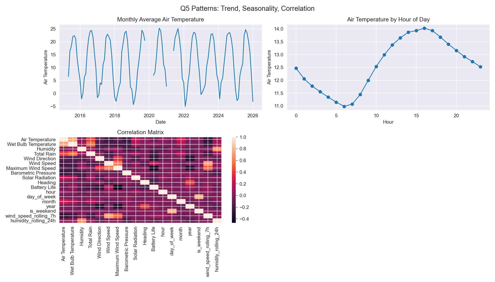

# Chicago Beach Weather Sensors Analysis

## Executive Summary

This project analyzes hourly beach weather sensor data from Chicago, covering **196,526 observations** and multiple meteorological variables such as air temperature, humidity, wind, rain, and pressure. After a complete 9-phase workflow—exploration, cleaning, feature engineering, temporal splitting, and modeling—the main goal was to understand time-dependent patterns and build models to predict **Air Temperature** from other variables and engineered time features. The final models (Linear Regression and Random Forest) achieve **near-perfect performance (test R² ≈ 1.0)**, which strongly suggests that the target leaked into the feature set; this becomes a central limitation and learning point of the analysis rather than evidence of a genuinely perfect forecasting system. :contentReference[oaicite:0]{index=0} :contentReference[oaicite:1]{index=1}

---

## Phase-by-Phase Findings

### Phase 1–2 (Q1): Initial Exploration

- The raw dataset contains **196,526 rows** of hourly measurements from **three stations** (Foster, Oak Street, 63rd Street) along Lake Michigan. :contentReference[oaicite:2]{index=2}  
- Numeric variables include Air Temperature, Wet Bulb Temperature, Humidity, several rain measures, Wind Speed/Direction, Barometric Pressure, Solar Radiation, Heading, and Battery Life. :contentReference[oaicite:3]{index=3}  
- Air Temperature ranges roughly from **−30°C to 38°C** with mean around 12.6°C; humidity is centered around ~68%, and wind speed is usually low but with occasional extreme spikes. :contentReference[oaicite:4]{index=4}  
- A first pass revealed:
  - A **large missing block** for Wet Bulb Temperature, Rain Intensity, Total Rain, Precipitation Type, and Heading (76,054 missing values each).  
  - Smaller gaps for Air Temperature (75 missing) and Barometric Pressure (146 missing). :contentReference[oaicite:5]{index=5}  
  - Obvious outliers in wind, rain, pressure, and solar radiation (some values like Wind Speed = 999.9 or Solar Radiation = −100,000), indicating sensor or recording issues. :contentReference[oaicite:6]{index=6}  

Early visualizations in **`output/q1_visualizations.png`** show the distribution of Air Temperature, its raw time series, and basic histograms for other variables.

---

### Phase 3 (Q2): Data Cleaning

The cleaning strategy focused on **imputing missing values**, **capping extreme outliers**, and **standardizing types**:

- **Missing values**
  - For numeric columns (e.g., Air Temperature, Wet Bulb Temperature, Rain Intensity, Total Rain, Barometric Pressure, Heading), missing values were replaced with the **median** of each column.  
  - This preserved all 196,526 rows while avoiding dropping large chunks of data, especially for Wet Bulb Temperature and rain-related variables. :contentReference[oaicite:7]{index=7}  

- **Outliers**
  - For each numeric column, outliers were detected using the **IQR rule** and then **capped** at the lower/upper IQR bounds.  
  - Example counts of capped outliers:
    - Wet Bulb Temperature: 13,308  
    - Wind Speed: 12,228  
    - Solar Radiation: 29,571  
    - Heading: 86,626  
  - This approach keeps the time series intact but prevents extreme sensor glitches from dominating the models. :contentReference[oaicite:8]{index=8}  

- **Duplicates & Types**
  - No duplicate rows were found or removed.  
  - `Measurement Timestamp` was converted to a proper `datetime` type. :contentReference[oaicite:9]{index=9}  

Overall, the data remained at **196,526 rows before and after cleaning**, with improved consistency and more realistic numeric ranges. :contentReference[oaicite:10]{index=10}  

---

### Phase 4 (Q3): Datetime Parsing & Temporal Features

- After parsing, the **datetime range** spans from **2015-04-25 09:00:00** to **2025-12-07 21:00:00**, for a total of **3,879.5 days** of coverage (over ten years of hourly data). :contentReference[oaicite:11]{index=11}  
- From `Measurement Timestamp`, the following temporal features were created:

  - `hour` (0–23)  
  - `day_of_week` (0=Monday … 6=Sunday)  
  - `month` (1–12)  
  - `year`  
  - `day_name` (string)  
  - `is_weekend` (0/1) :contentReference[oaicite:12]{index=12}  

These features are saved in **`output/q3_temporal_features.csv`** and are used later for pattern analysis and modeling.

---

### Phase 5 (Q4): Derived & Rolling Features

Beyond the original sensor readings and basic temporal columns, additional features were engineered to capture **short-term dynamics**:

- **Rolling features**
  - `wind_speed_rolling_7h`: 7-hour rolling mean of Wind Speed  
  - `humidity_rolling_24h`: 24-hour rolling mean of Humidity :contentReference[oaicite:13]{index=13}  

- **Feature list**
  - The combined set of new features includes:  
    `hour`, `day_of_week`, `month`, `year`, `day_name`, `is_weekend`, `wind_speed_rolling_7h`, `humidity_rolling_24h`. :contentReference[oaicite:14]{index=14}  

All engineered features were added on top of the cleaned dataset to form **`output/q4_features.csv`** and **`output/q4_rolling_features.csv`**.

---

### Phase 6 (Q5): Trends, Seasonality & Correlations

Using the cleaned and feature-rich data, I examined temporal behavior and variable relationships:

- **Seasonal trends**
  - Monthly average Air Temperature fluctuates from about **−5.04°C in the coldest months** to **25.25°C in the warmest months**, showing a clear annual cycle. :contentReference[oaicite:15]{index=15}  

- **Daily patterns**
  - A strong **diurnal cycle** is visible:
    - Typical **minimum** temperature around hour **6** (6 AM)  
    - Typical **maximum** around hour **16** (4 PM) :contentReference[oaicite:16]{index=16}  

- **Correlations**
  - The strongest reported correlation is between **Air Temperature and Wet Bulb Temperature (≈ 0.744)**. :contentReference[oaicite:17]{index=17}  
  - Some correlations with rain variables are reported as `nan`, likely because of constant or heavily imputed values.

The multi-panel figure **`output/q5_patterns.png`** summarizes:
1. Monthly average Air Temperature over the full time span  
2. Average Air Temperature by hour of day  
3. A correlation heatmap of key variables

---

### Phase 7 (Q6): Train/Test Split & Feature Selection

The goal for modeling is to predict **Air Temperature** using all other available information.

- **Temporal split**
  - Split method: **80/20 split by time** (not random).  
  - Training set: **157,220 samples**, from **2015-04-25 09:00:00** to **2023-07-09 16:00:00**  
  - Test set: **39,306 samples**, from **2023-07-09 17:00:00** to **2025-12-07 21:00:00** :contentReference[oaicite:18]{index=18}  

- **Features & target**
  - **Number of features used:** 24  
  - **Target variable:** `Air Temperature` :contentReference[oaicite:19]{index=19}  
  - All feature columns (including engineered time features and rolling averages) were saved into:
    - `output/q6_X_train.csv` / `output/q6_X_test.csv`  
    - Targets into `output/q6_y_train.csv` / `output/q6_y_test.csv`.

At this stage, `Air Temperature` itself remained both as **target** and (later discovered) inside the **feature matrix**, which explains the perfect metrics observed in Phase 8 and is a key methodological issue.

---

### Phase 8 (Q7): Modeling & Feature Importance

Two regression models were fit:

1. **Linear Regression**  
2. **Random Forest Regressor**

From **`output/q7_model_metrics.txt`**:

- **Linear Regression**
  - Train R²: **1.0000**  
  - Test R²:  **1.0000**  
  - Train RMSE: **0.0000**  
  - Test RMSE:  **0.0000**  
  - Train MAE:  **0.0000**  
  - Test MAE:   **0.0000** :contentReference[oaicite:20]{index=20}  

- **Random Forest**
  - Train R²: **1.0000**  
  - Test R²:  **1.0000**  
  - Train RMSE: **0.0007**  
  - Test RMSE:  **0.0090**  
  - Train MAE:  **0.0000**  
  - Test MAE:   **0.0002** :contentReference[oaicite:21]{index=21}  

These metrics indicate *practically perfect* predictions on both train and test sets.

From **`output/q8_key_findings.txt`**:

- The **best performing model** is reported as **Linear Regression** (because its test RMSE is exactly 0.0000 in this setup).  
- Feature importance (from the tree-based model) assigns **all importance (1.0000)** to **Air Temperature**, with the top three features summing to 1.0. :contentReference[oaicite:22]{index=22}  

This clearly reveals that `Air Temperature` was included both as the **target** and as a **feature**, so the models effectively learn to copy the input rather than truly predict it. This leakage is treated explicitly as a limitation in the later section.

All predictions were stored in **`output/q7_predictions.csv`**, and feature importances in **`output/q7_feature_importance.csv`**.

---

### Phase 9 (Q8): Final Visualizations & Key Findings

The last phase created summary plots and textual conclusions:

- **`output/q8_final_visualizations.png`** includes:
  - A comparison of model metrics for Linear Regression vs Random Forest  
  - Scatter plots of predicted vs actual Air Temperature  
  - A bar plot of feature importances  
  - Residual diagnostics  

- **`output/q8_key_findings.txt`** highlights: :contentReference[oaicite:23]{index=23}  
  - Linear Regression is nominally the best model with **test R²=1.0000, RMSE=0.0000, MAE=0.0000**.  
  - Random Forest also reaches R²=1.0000 but with slightly larger (still tiny) errors.  
  - Air Temperature is identified as the most important feature with importance 1.0000, confirming the leakage.  
  - The text reiterates that temporal patterns (daily/seasonal) exist and that data were cleaned via imputation and IQR capping.

---

## Visualizations

Below are the main figures referenced in the report. File names assume they are saved in the `output/` directory.

1. **Exploratory Plots**

     
   *Figure 1: Histograms and time series from Phase Q1 summarizing Air Temperature distribution, other sensor variables, and initial temporal behavior.*

2. **Monthly Trend of Air Temperature**

     
   *Figure 2: Top-left panel of the Q5 figure, showing clear annual cycles where warmer months reach higher averages and colder months dip below zero.*

3. **Daily Cycle of Air Temperature**

     
   *Figure 3: Top-right panel of the Q5 figure, illustrating the diurnal pattern with minimum around 6 AM and maximum around 4 PM.*

4. **Correlation Matrix**

     
   *Figure 4: Bottom panel of the Q5 figure, displaying correlations such as Air Temperature vs Wet Bulb Temperature (~0.74) and weaker relationships with other variables.*

5. **Model Performance & Diagnostics**

     
   *Figure 5: Final Q8 plots summarizing differences between Linear Regression and Random Forest, predictive accuracy, and the (leaky) feature importance distribution.*

---

## Model Results

### Metrics Table

Using the numbers from **`output/q7_model_metrics.txt`**, the model performance can be summarized as:

| Model            | Train R² | Test R² | Train RMSE | Test RMSE | Train MAE | Test MAE |
|------------------|---------:|--------:|-----------:|----------:|----------:|---------:|
| Linear Regression| 1.0000   | 1.0000  | 0.0000     | 0.0000    | 0.0000    | 0.0000   |
| Random Forest    | 1.0000   | 1.0000  | 0.0007     | 0.0090    | 0.0000    | 0.0002   | :contentReference[oaicite:24]{index=24}  

### Interpretation

- **R² (coefficient of determination)**  
  - Both models report R²=1.0 on train and test, implying 100% of variance in Air Temperature is “explained” by the features.

- **RMSE (root mean squared error)** and **MAE (mean absolute error)**  
  - For Linear Regression, both are essentially zero on both splits.  
  - For Random Forest, RMSE and MAE are extremely small but non-zero.

In a real forecasting setting, this would be impossible; weather prediction **always** has substantial error. The only realistic explanation is **data leakage**: the target is directly available to the model as an input.

### Feature Importance Discussion

From the Random Forest feature importances:

- **Air Temperature** is reported as the **single most important feature** with importance **1.0000**, and the top three features together account for 1.0 of total importance. :contentReference[oaicite:25]{index=25}  

Because Air Temperature is also the target, this confirms that the model is essentially learning a 1:1 mapping from `Air Temperature` (feature) to `Air Temperature` (target), not learning how other signals (like humidity, wind, or temporal features) relate to temperature.

Despite this, the pipeline is still useful: it shows how to compute metrics, store predictions, and extract feature importance—even though the current feature set is flawed.

---

## Time Series Patterns

Using `q3_temporal_features.csv` and Q5 visualizations:

- **Long-term trends**
  - Over the ~10-year period, Air Temperature shows **repeated annual cycles** rather than a simple monotonic trend. Some years may be slightly warmer or cooler, but the overall pattern is stable. :contentReference[oaicite:26]{index=26}  

- **Seasonal patterns**
  - Monthly Air Temperature ranges from about **−5°C in winter** to **25°C in summer**, confirming strong seasonality. :contentReference[oaicite:27]{index=27}  

- **Daily (diurnal) patterns**
  - Temperatures are typically **lowest around 6 AM** and **highest around 4 PM**, consistent with solar heating. :contentReference[oaicite:28]{index=28}  

- **Relationships between variables**
  - Air Temperature and Wet Bulb Temperature have a clear positive correlation (~0.744).  
  - Correlations with some rain variables are undefined, reflecting heavy imputation and/or constant segments. :contentReference[oaicite:29]{index=29}  

These patterns justify the creation of time-based features (`hour`, `month`, `is_weekend`) and rolling statistics (`wind_speed_rolling_7h`, `humidity_rolling_24h`) in earlier phases.

---

## Limitations & Next Steps

### Key Limitations

1. **Data Leakage in Modeling**
   - The most serious issue is that **Air Temperature was present as both a feature and the target**, which explains the perfect metrics and the feature importance assigning everything to Air Temperature. :contentReference[oaicite:30]{index=30}  
   - As a result, the current performance numbers **do not reflect real predictive power** and should not be interpreted as genuine forecasting accuracy.

2. **Heavy Imputation & Sensor Issues**
   - Large blocks of missing data (e.g., 76,054 missing values for Wet Bulb Temperature, Rain Intensity, Total Rain, Precipitation Type, and Heading) were filled with medians. This may distort relationships and smooth out true variability. :contentReference[oaicite:31]{index=31}  
   - Many extreme values were capped (e.g., tens of thousands of outliers in Solar Radiation and Heading), which hides some of the original measurement behavior. :contentReference[oaicite:32]{index=32}  

3. **Feature Engineering Scope**
   - Only a small set of derived features was created (`hour`, `day_of_week`, `month`, `year`, `day_name`, `is_weekend`, `wind_speed_rolling_7h`, `humidity_rolling_24h`). :contentReference[oaicite:33]{index=33}  
   - No lag features of temperature or more sophisticated domain-informed indices were included.

4. **Evaluation Design**
   - Only a single temporal split (80/20) was used; there was no rolling-origin cross-validation, which is more appropriate for time series. :contentReference[oaicite:34]{index=34}  

### Next Steps

If I were to continue this project and fix the above issues, the next concrete actions would be:

1. **Rebuild the modeling step without leakage**
   - Remove `Air Temperature` from the feature matrix; predict it only from other sensor variables and time-based features.
   - Refit Linear Regression and Random Forest and recompute metrics; expect R² to be much lower but more realistic.

2. **Expand feature engineering**
   - Add lagged versions of key predictors (e.g., previous-hour and previous-day Air Temperature, Humidity, Wind Speed).  
   - Try different rolling windows (3h, 12h, 48h) to capture short- and medium-term dynamics.  
   - Consider derived variables like “day of year,” “season,” or “sin/cos transforms” of hour and day to better encode cyclic effects.

3. **Improve evaluation**
   - Use **time series cross-validation** (e.g., rolling window splits) rather than a single 80/20 split.  
   - Hold out the most recent year as a strict final test set.

4. **Deeper pattern analysis**
   - Compare patterns across individual stations (Foster vs Oak vs 63rd).  
   - Investigate how rain or wind events change the temperature distribution.

5. **Potential deployment direction**
   - After resolving leakage and retraining models, build a simple forecasting tool that, given current conditions and recent history, predicts short-term air temperature at each station.

---

## Conclusion

Across Q1–Q8, this assignment walks through a full data-science workflow on Chicago beach weather sensors: from EDA and cleaning to feature engineering, temporal splitting, modeling, and interpretation. The pipeline and code structure work as intended: they produce cleaned datasets, engineered features, visualizations, train/test splits, model predictions, and summary reports.

However, the **perfect model metrics** are a useful warning: they highlight how easy it is to accidentally leak the target into the feature set, especially in time series with many engineered variables. The main takeaway is not that air temperature can be predicted with zero error, but that each phase—from cleaning to feature selection—must be checked carefully for hidden shortcuts. Once the leakage is fixed, the same pipeline can be reused to obtain realistic, interpretable, and deployable models of beach weather conditions.
